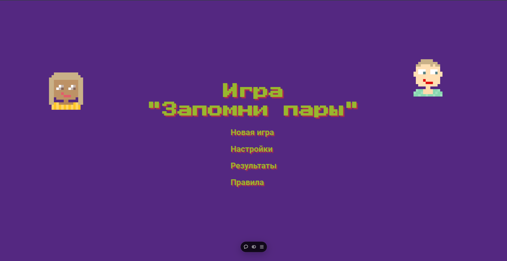

# "Запомни пары"

[Ссылка на деплой](https://ds-task1-tas2.vercel.app/)

## Нужно переворачивать карточки и запоминать их расположение. Если вы перевернули две одинаковые карточки, то они открываются навсегда и вы получаете очки.

## Реализовано несколько уровней сложности, сохранение статистики игр, рекорда, и сортировка результатов.

### Не забудьте установить зависимости `npm i`